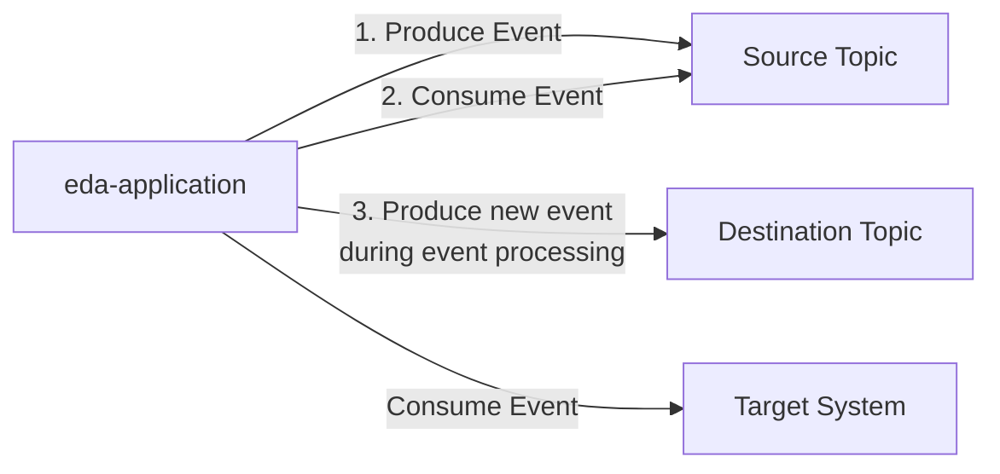

# Event Driven Architecture - Consume, process, and produce event pattern

This repository demonstrates the _Transactional Consume–Produce_ pattern using
an event-driven architecture. It showcases how to consume events from a source,
process them, and produce new events to a target system in a transactional
manner. The repo uses the [KafkaFlow](https://github.com/Farfetch/kafkaflow)
library to facilitate Kafka integration.



## API Produce event endpoint

```bash
mkdir eda-api
cd eda-api
dotnet new webapi
```

## Kafka cluster setup

I use Aiven to create a managed Kafka cluster at:
<https://console.aiven.io/account/a530d754cb24/project/fredrkl-0955/services/kafka-14f487f0/overview>.

## Aiven CLI setup

```bash
avn user login --token
```

Then enter the `AIVEN_CLI_TOKEN` from the `.envrc` file.

### Create Kafka topic

```bash
avn service topic-create kafka-14f487f0 source-topic \
--partitions 3 \
--replication 3

avn service topic-create kafka-14f487f0 destination-topic \
--partitions 3 \
--replication 3

avn service topic-create kafka-14f487f0 kafka-flow.admin \
--partitions 3 \
--replication 3
```

## Adding KafkaFlow to the project

```bash
cd eda-api
dotnet add package KafkaFlow
dotnet add package KafkaFlow.Microsoft.DependencyInjection
dotnet add package KafkaFlow.Serializer.JsonCore
```

## Kafka transactions

I wanted to showcase how to use Kafka transactions to ensure that consuming and
producing events are done atomically. This means that if the processing of an
event fails, the consumed event is not acknowledged, and no new events are
produced. We have in our project deliberately stated that producing should
happen as the last statement in the event handler, thus minimizing the risk of
producing an event without having processed the consumed event.

## Lessons learned

- KafkaFlow admin does not create the admin topic automatically.

## Resources

- <https://learn.microsoft.com/en-us/azure/architecture/guide/architecture-styles/event-driven>
- <https://farfetch.github.io/kafkaflow/>
